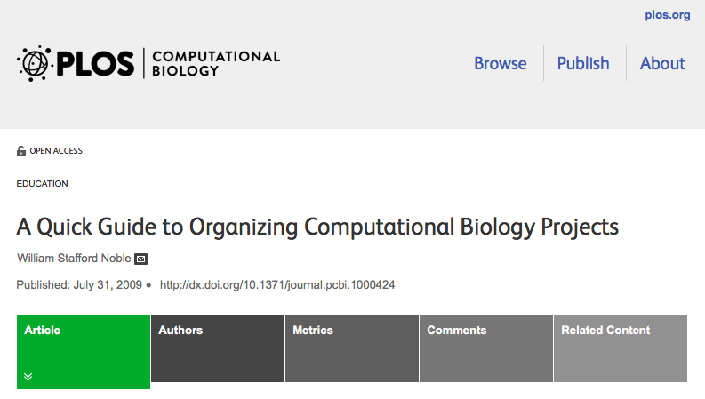
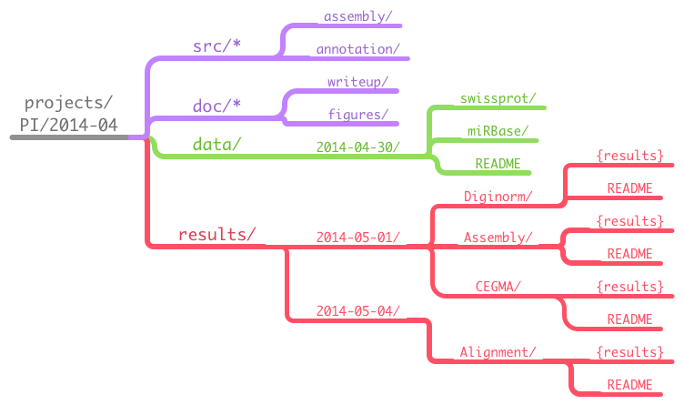

build-lists: false
footer: HPCBio, 2016
slidenumbers: true

# Data Organization

**Chris Fields**
Data Carpentry Workshop
May 19, 2016

---

## Objectives

- Help you organize your data (including raw data, documentation, source code, and such)
- Understand why it is important to separate data from analysis (process)

---

## Introduction

* Project organization is one of the most important parts of any project
* Think about organization prior to start, but never too late to start!

^Project organization is one of the most important parts of a sequencing project, but is often overlooked in the excitement to get a first look at new data. While it's best to get yourself organized before you begin analysis, it's never too late to start.

---

## Introduction

* Think about the project as a biological experiment
	* How do you design an experiment?
	* How many variations on analyses can you perform?

^You should approach your project in a very similar way to how you do a biological experiment, and ideally, begins with experimental design. We're going to assume that you've already designed a beautiful sequencing experiment to address your biological question, collected appropriate samples, and that you have enough statistical power. For all of those steps, collecting specimens, extracting DNA, prepping your samples, you've likely kept a lab notebook that details how and why you did each step, but documentation doesn't stop at the sequencer!

---

## Introduction

* How do you track experimental data and analyses?
	* ( I am hoping a few will say a lab notebook :smiley: )

---

## Introduction

* You *document* them, keeping as much information as possible about...
	* Overall experimental design
	* How data are generated (experimental conditions, treatments, replicates, processed batches, etc)
	* How data are further processed
	  * filtered, normalized, condensed, visualized, etc.


---

## Introduction
		
* You should think about this when performing computational analyses
	* How do you organize your data? 
		* Think about what kinds of data you start with
		* What you will probably generate
* What is the best way to name your data and your directories?

^Every computational analysis you do is going to spawn many files, and
inevitability, you'll want to run some of those analysis again. Genomics
projects can quickly accumulate hundreds, maybe thousands of files across tens of folders. Do you remember what PCR conditions you used to create your sequencing library? Probably not. Similarly, you probably won't remember whether your best alignment results were in Analysis1, AnalysisRedone, or AnalysisRedone2; or which quality cutoff you used.

---

## Noble paper



---

## Noble paper

A representative layout[^1]:


^Luckily, recording your computational experiments is even easier than recording lab data. Copy/Paste will become your best friend, sensible file names will make your analysis traversable by you and your collaborators, and writing the methods section for your next paper will be a breeze. Let's look at the best practices for documenting your genomics project.

[^1]: [A Quick Guide to Organizing Computational Biology Projects](http://journals.plos.org/ploscompbiol/article?id=10.1371/journal.pcbi.1000424)

---

We have adopted a very similar layout within HPCBio projects (note we also add documentation with each analysis):



---

Though this takes some getting used to, I have found it does help significantly (and you can evolve this scheme to best fit within your workflow).

Your future self will thank you. :smiley:

---

## Exercise

In today's exercises we will setup a filesystem for the project we will be using in the next session.  You will use these shell commands/programs/tools:

* ``mkdir`` - create directories
* ``pwd`` - print the current (present) working directory
* ``history`` - view bash history
* ``tail`` - view end of file

---

## Exercise

* ``|`` - UNIX pipe
* ``nano`` - editor
* ``>>`` - append to file
* ``ln`` - create UNIX links (we'll use symbolic links) 

---

## Exercise

### Create file system for a project

Inspired by the Noble guide, we will start by create a directory that we can use for the rest of the workshop:

---

First, make sure that you are in your home directory:

```bash
$ pwd
/home/a-m/<USER_NAME>
```

**Tip:** Remember, when we give a command, rather than copying and pasting, just type it out. Also the ``$`` indicates we are at the command prompt, do not include that in your command.

**Tip** If you were not in your home directory, the easiest way to get there is to enter the command ``cd`` which always returns you to home.

---

Next, try making the following directories using the ``mkdir`` command

* ``dc_workshop``
* ``dc_workshop/docs``
* ``dc_workshop/data``
* ``dc_workshop/results``
* ``dc_workshop/src``

---

Verify that you have created the directories;

```bash
$ ls -R dc_workshop
```

---

If you have created these directories, you should get the following output from that command:

```bash
$ ls -R dc_workshop
dc_workshop/:
data  docs  results  src

dc_workshop/data:

dc_workshop/docs:

dc_workshop/results:

dc_workshop/src:
```

---

### Document your activity on the project

The *history* command is a convenient way to document the all the commands you have used while analyzing and manipulating your project. Let's document the work we have done to create these folders.

---

A. View the commands that you have used so far during this session using ``history``:

```bash
$ history
```

The history likely contains many more commands that you have used just for these projects. Let's view the last several commands so that focus on just what we need for the project.

---

B. View the last n lines of your history (where n = approximately the last few lines you think relevant - for our example we will use the last 7:

```bash
$ history | tail -n7
```

As you may remember from the shell lesson, the pipe ``|`` sends the output of history to the next program, in this case, tail. We have used the -n option to give the last 7 lines.

---

C. Using your knowledge of the shell use the append redirect ``>>`` to create a file called ``2016-05-19_dc_workshop_log.txt`` (Use the four-digit year, two-digit month, and two digit day, e.g. ``2016-05-19_dc_workshop_log.txt``)

---

D. You may have noticed that your history may contain the ``history`` command itself. To remove this redundancy from our log, lets use the ``nano`` text editor to fix the file:

```bash
$ nano dc_workshop_log
```

From the nano screen, you should be able to use your cursor to navigate, type, and delete any redundant lines.

---

E. Add a dateline and comment to the line where you have created the directory e.g.

```bash
# 2016_05_19
# Created sample directories for the Data Carpentry workshop
```

---

F. Next, remove any lines of the history that are not relevant. Just navigate to those lines and use your delete key.

---

G. Close nano by hitting `Control` and the `X` key at the same time; notice in nano this is abbreviated `^X`; nano will ask if you want to save; hit `Y` for yes. When prompted for the 'File Name to Write' we can hit 'Enter' to keep the same name and save.

---

H. Now that you have created the file, move the file to `dc_workshop/docs` using the ``mv`` command.

---

## Questions:

1. What is the default number of lines that tail displays?

2. What is the difference between ``>`` and ``>>``

3. Why do we split `data` and `results` into separate folders?